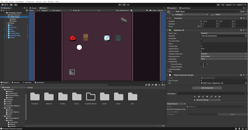
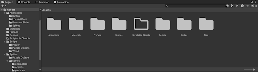
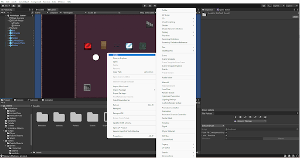
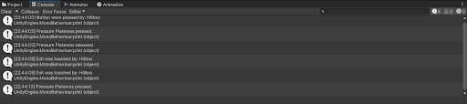
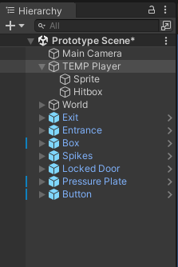
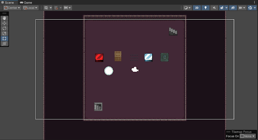
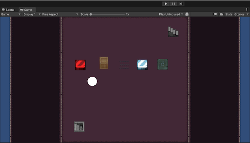
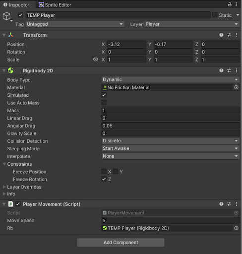
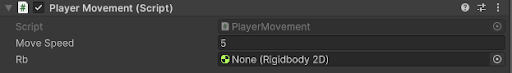

<!-----

You have some errors, warnings, or alerts. If you are using reckless mode, turn it off to see inline alerts.
* ERRORs: 0
* WARNINGs: 0
* ALERTS: 9

Conversion time: 2.916 seconds.

Using this Markdown file:

1. Paste this output into your source file.
2. See the notes and action items below regarding this conversion run.
3. Check the rendered output (headings, lists, code blocks, tables) for proper
   formatting and use a linkchecker before you publish this page.

Conversion notes:

* Docs to Markdown version 1.0β34
* Fri Jan 27 2023 16:23:14 GMT-0800 (PST)
* Source doc: Unity Tutorial
* This document has images: check for >>>>>  gd2md-html alert:  inline image link in generated source and store images to your server. NOTE: Images in exported zip file from Google Docs may not appear in  the same order as they do in your doc. Please check the images!

----->

# Intro To Unity

## Introduction

**What is Unity?**

Unity is a game engine, which is a software framework used to make, well, games! It includes libraries, systems and UI that is handy in developing almost any game. In short, game engines make the process of developing games easier, and usually allow you to prototype games before fully investing in them.

**Why Unity?**

Although there are many other game engines, see [Unreal](https://www.unrealengine.com/en-US/unreal-engine-5), [GoDot](https://godotengine.org/) or [Construct](https://www.construct.net/en). Unity is considered the most popular and frequently used. Honestly, Unity is considered easy to jump into and good to prototype with. You can quickly make a mock scene of what you want your main game to look like with little to no code. Unity has a lot of support from other programs like Blender and Maya for 3D modeling. But, in my opinion, Unity’s biggest advantage is its popularity. You can probably find a tutorial on basically any popular mechanic you might want to implement. And the way it’s implemented usually doesn’t conflict with your existing code. This makes it easy to get help whenever you need instead of mindlessly browsing the internet. Unity does also come with some downsides, while I can’t comfortably discuss the details, my biggest problem with Unity is its lack of straightforwardness. You’ll come to see that there are a multitude of ways to do the same ‘thing’ and each method comes with its own pros and cons. Unlike other engines, there is no one ‘catch all’ method. So you’ll need to truly understand the benefits of your choices and see if they will bite you in the foot later down the road. Anyway, that’s enough introduction, let’s jump into the tutorial…

## Overview

**How does Unity work?**

**Gameobjects **are Unity’s most basic representation of any physical ‘thing’ you want in the game. This can be the player, a rock, the background, the SPRITE of the player, the HITBOX of the player, a UI button, etc. As you can see, it's very abstract. All gameobjects have a name, a transform and some other features that we’ll discuss later. 

_Note: A transform is just a representation of the gameobjects position, rotation and scale (size) in the world._

Unity’s goal is to allow the player to give _meaning _to these gameobjects by assigning them _functionality_. For example, if you want your gameobject to be an image of the player, you can give it the functionality of ‘rendering a sprite’. If you want it to shine, you can give it the ability to ‘emit light’. This functionality is given through what are called **Components. **Unity has a bunch of pre-built components that give their respective gameobjects a variety of functionality like movement, sprite rendering, animation, etc.  

_Note: Transforms are technically a component, but are always attached to any gameobject._

But giving a gameobject a certain functionality doesn’t immediately mean that it's ready to be shipped out. Based on the rules of the game that you’ve decided, that functionality needs to be changed depending on the game state. Just because a gameobject _can _move in space doesn’t mean it _should _always be traveling at mach 3.  That's where** Scripts **come in. Scripts are programmer-defined components that tell other components how they should behave. For example, now that your gameobject has the functionality to move in space, your ‘Movement’ script will tell that component to set its speed to some value when the WASD keys are pressed. Now we have some gameplay, although not very riveting.

**What now?**

To be honest, **that’s it. **Unity,_ or game development for that matter_, boils down to deciding what functionality should happen at what time. Your goal as a programmer would be to decide what components to use on which objects and to write scripts to give unique behavior to your components. The rest of this tutorial will go into the most popular/important components in Unity and how to use them. Afterwards we’ll give you some incomplete scripts to which you’ll fill out and hopefully see them work in-game. 

_Note: This guide is optional. If you want to create a brand new project and play around with Unity yourself, feel free. The rest of this guide is for those who want more direction and physical examples._

## Interface

### **Overview**

Let's take a moment to go over the basics of the unity interface! The Unity Interface may seem daunting, but after getting enough experience with it, it’ll feel right at home.

### **Project Tab**

At the bottom of the screen is a window with multiple tabs. The first tab is called the Project Tab, also known as the Asset Directory. This is where all our assets will be stored! A game’s assets consist of scripts, tiles, sprites, animations, and much more, so there will be a lot of them. Therefore Unity provides this space where we can organize all our assets by category, nice and neat. 

_Tip: Take the extra step of organizing your assets so you don’t run into problems finding your data when your project becomes bigger!_

You can **[Right Click]** anywhere within the Assets tab and create new assets such as scripts, scenes (levels), folders, and more!

### **Console Tab**

In the same window, the tab right next to our Project Tab is called the Console Tab. This tab will display any debug logs and Compiler errors we get from our scripts.

### **Hierarchy Tab**

This next tab is on the window on the leftmost side of the screen. The Hierarchy Tab organizes the game objects currently present within our scene! Here we can create new game objects, and even place game objects within other game objects to separate functionalities. 

### **Scene Tab**

The center of your screen is occupied by the Scene Tab. This is where we can interact and build our current game scene. You can **[Drag]** existing game objects around to your liking or delete them entirely. Also, we can **[Drag and Drop] **prefabricated assets from our Project window into our scene.

### **Game Tab**

In the same region, right next to the Scene Tab is our Game Tab. This tab allows us to play our current scene and test out the game! To play the game hit the play button above, this will take Unity into play mode (Visually this gives a darker overlay to the rest of the UI). You can pause playmode and interact with your objects and test things out like in normal mode. Otherwise to exit playmode press the play button once more

**DISCLAIMER:** When editing in unity **MAKE SURE YOU ARE NOT IN PLAY MODE.** Editing in playmode **WILL REVERT ANY CHANGES** after you’ve exit playmode! Keep this in mind to reduce loss of work + potential bruh moments.

### **Inspector Tab**

The last tab we will look at is at the rightmost of our screen. The Inspector Tab allows you to see the components and properties (Position, Scripts, etc.) of a game object! This window allows you to edit these components and properties and add new scripts and components.

### **Final Thoughts**

These are just the most commonly used tabs in Unity. As you continue working on your game, you will begin to discover more and more tabs. Remember you can always re-organize these tabs by **[Drag and Drop]**ing into different windows.

## Scripting

### **Prelude**

Before writing our first script, let’s give some context. Most of our scripts will be derived from the Monobehaviour class. For those who didn’t take a data structures class, this just means that it will have a bunch of pre-defined functionality that is being used without us needing to know. But we can utilize those functions to help us better define our gameobject’s behavior. 

For example, the most popular functions that we will be defining are **Start()**, and **Update()**. When you make a new script these are automatically written for you. Start() is a function that is always called at the **first frame** that gameobject is created, whether that be when you run the game or spawn (or Instantiate) that gameobject. Start() always only called ONCE. Update() on the other hand is called on **every frame **that object exists in your world (or Scene). 

As you can imagine, we can use Start() to define any behavior that should happen once, when the gameobject spawns and use Update() when we want something to happen over time or continuously. We can then use a combination of ‘if’ statements to impose conditions on our recurring functionality. Although these 2 are the most common, there are a bunch of other functions that may suit our needs better like OnMouseOver(), which gets called ONCE when a mouse enters the bounds of a gameobject. 

Here is [a list](https://docs.unity3d.com/ScriptReference/MonoBehaviour.html) of ALL of the monobehaviour functions that we have access to, it’s a good idea to have this with you so you always know which functions to use in your scripts.

Before writing the scripts you will implement, here are some debugging tips. 

* Use the **print(string message)** function to print any text you want in the console in places you want your functions to run. 
* Also to see the references of your scripts in the Unity engine, write **[SerializeField]** in front of your global variables. Public variables are automatically serialized.
    * For example, if you have a variable ‘private Animator myAnimator’ rewrite it to ‘[SerializeField] private Animator myAnimator’

### **Character Controller**

Alrighty, so the bare minimum of any great game is some movement of course! So Let's get started.

Let’s create our player character.** In unity, within your Hierarchy right click and create a 2D Circle Object. **This will be our current player’s sprite.

Now to get our player moving, we need to add our movement script and some helpful components.** Click on the circle in the Hierarchy to open its Inspector tab. **Let's add two components:

1. **Click “Add Component” **at the bottom
2. Search for “**Rigidbody 2D**” and add it to our player.
3. Search for “**Circle Collider 2D**” and add it as well

**Rigidbody 2D** is essentially a component that will allow us to move our player character. ( Or serves as our character’s body per say). It has several parameters (Liner Drag, Mass) that let us adjust our final character's movement. We’ll be using it in our script as well

**Circle Collider 2D** is another component that handles collisions. It creates a hitbox around our character that detects collisions. This way, if our player hits a wall, they’ll collide and stop moving! Rather than flying straight through the wall like a spooky ghost.

Aight, with our components in, let's get to writing our movement script! Normally, whenever you want to add a new script to your object, you can search for “New Script” under the same Add Component tab, name your script, and add it to your object.

We already have a player script with some simple skeleton code in our project! So lets get started:

1. Go into **Assets → Scripts → Player**
2. Drag the **PlayerMovement.cs **script into the Inspector to add it to our player character (Don’t get scared by the red cross, Hover right over a component to add the script)
3. Open **PlayerMovement.cs** (by double clicking or right click **→ **Open)

Within the script you’ll see two methods, an **Update()** and **Fixed Update()** method, some quick explanations:

**Update()**: Method that is called once per frame, this is ideal for getting player inputs, so **we’ll use Update() to get inputs for our movement**

**Fixed Update()**: Similar to update, but executed on a fixed timer. The finer details are muddy, but the framerate being tied to the time makes this method optimal for physics.** We’ll use our inputs from Update() to actually move our character in Fixed Update().**

There’s already some code and comments in these methods that we’ll fill out, but first lets declare some variables. **Above the update method, declare**:

1. A **public float** called **moveSpeed**, set this equal to a number like **5f**.
2. A** public Rigidbody2D **called** rb**. Yup, you can declare components as variables, and** we’ll be using the same Rigidbody we added earlier to move our character.**
3. A** Vector2 **called **movement**. This is a vector value that will store x and y values of our player’s movement. So **this will be used to handle input.**

Setting the top two variables to **public **will allow us to manually set their variables back in our Inspector UI from Unity! We don’t need to set our Vector2 to public so don’t worry about that.

**Update(): **

Now that we’ve declared our variables, lets get cooking, within our Update function, you’ll see:

 movement.x = Input.GetAxisRaw("Insert Direction Here");

 movement.y = Input.GetAxisRaw("Insert Direction Here");

 Since **movement **is a Vector, it** will store the x and y coordinates that our player moves**! We get our player’s input from the method **Input.GetAxisRaw**. So how do we actually get player’s inputs using Input.GetAxisRaw? 

Unity has a built in system where input keys (WASD, ← ↑ → ↓ ) are already mapped to movement! Horizontal movement is already mapped to their specific keys (AD, ← →), and with Vertical as well. To access these inputs, Unity maps the respective movement above to  **“Horizontal”**and **“Vertical” **within the engine. **Now with this knowledge, set movement’s x and y parameters to their respective inputs!**

**FixedUpdate(): **

Finally, let's check out FixedUpdate() to move our character! Within this method, you’ll see:

//rb.MovePosition(____+ ____ * ____ * _____);

Uncomment this line. Our RigidBody rb has a built-in function called MovePosition, which will essentially move our player character.  In order to move our character, We’ll want to:

1. Add our **Current Position **to our **New position**,
2. Multiply the above by our **movement Speed,**
3. Multiply the above by a **framerate Constant, **( To keep our movement constant under time)

Our input is broken down by the small formula below:

 **Current Position + New position * movement Speed * ** **framerate Constant**

With this knowledge, finish our implementation in MovePosition! These tidbits might come in handy:

* Our player’s **current position **can be given by **rb.position**
* The  **framerate Constant **can be given by **Time.fixedDeltaTime**

Finally, after saving head back into unity. You’ll see that under our PlayerMovement tab in the inspector there is now an input for Move Speed and Rigidbody 2D

Drag the same Rigidbody2D in the inspector (by dragging the topmost part) into the Rb input slot. This sets our Rb variable from our code to the Inspector Rigidbody2D! You can also now adjust our speed variable here in unity as well. 

Now if you hit play, _Viola!_ We can now move our character! We’re now well on our way to making our game. If you try running into the box, you should be able to move it around thanks to our Collider component!

We’ll be using this box as the focal point of our puzzle mechanics, as it will be used to push down our button and pressure plate to trigger events! However, currently this functionality has not been built yet. In the rest of our Tutorial, we’ll be going over how to implement these mechanics, so let's get right into it!

### **Puzzle Mechanics**

#### **Part 1**

Let’s define our ‘pressure plate’. In theory, a pressure plate is much like a button. It triggers some mechanism when it is pressed, and deactivates the mechanism when it is released. (while a button cannot be deactivated)

First, let’s open our Pressure Plate Script and edit it.

In our Project directory,

4. Go into **Assets → Scripts → Puzzle Objects**
5. Open **PressurePlateHandler.cs** (by double clicking or right click **→ **Open)

Once you open your script in your favorite editor, take a look at what’s given to you. The proper functions we need to implement are given. Let’s review the purpose of each.

* Awake()
    * Similar to Start(), Awake is always called BEFORE the first frame so it is always BEFORE Start(). This is where any references of scripts should be gathered.
* OnTriggerEnter2D()
    * This function is called when this gameobject enters a collision with another gameobject that has a ‘Collider2D’ component with the ‘isTrigger’ flag set. _This is already done for you._
* OnTriggerExit2D()
    * This function is called when this gameobject exits** **a collision with another gameobject that has a ‘Collider2D’ component with the ‘isTrigger’ flag set. _This is already done for you._

Let’s review what we want our Pressure Plate to do, in a general sense. When it is pressed, it should trigger its assigned mechanism and visually change its sprite. Once released, it deactivates its mechanism and reverts its appearance.

_Note: In the final version, you may want to play a sound or show particles but we will leave that for later_

Notice this means we need references to 2 other components, the pressure plate’s visuals and the mechanism we want to affect.

* First let’s address the mechanism. We’ve implemented a different class called Mechanism that we can assume already has the function Enable() and Disable() it.
* For changing our sprite, we would originally use a ‘Sprite Renderer’ component, but I’ve gone ahead and already created an ‘animation’ for a pressure plate ‘Pressed’ and ‘Released’. Therefore we will actually be needing an ‘Animator’ component reference rather than a Sprite Renderer.
    * _Note: Notice that we still need a ‘Sprite Renderer’ component on our gameobject even if we don’t reference it in our script. This is because our Animator will be interacting with our ‘Sprite Renderer’ instead of our Pressure Plate script._

Any components or variables we want to reference should be defined at the top of the class. If these references are on the SAME gameobject, then they should be gathered in the Awake() function before being used elsewhere in the class.

Now that we have a reference to our Animator and Mechanism, we need to decide when to call their appropriate functions. 

* Mechanism has an Enable() function for when we want to trigger the mechanism and a Disable() function for when we want to deactivate it.
* For the Animator we only care about the ‘Play(string name)’ function. This function takes in the name of the animation you want to play at that moment. To see all the names of the animations, back in your main screen, go to the Animator Tab whilst selecting the gameobject with the Animator Tab. The black or orange rectangles are the possible animations you can play.
    * _Note: Although it doesn’t matter for this tutorial, know that it is important that our animations don’t loop_

**Your job now is to implement the PressurePlateHandler.cs Decide what components you need, initialize them and use them in the appropriate functions. Once you do this, you will have a pressure plate that will trigger a given mechanism once it is pressed and deactivates it when it is released, whilst having visual feedback.**

#### **Part 2**

Now that we have our pressure plate working, let’s implement a mechanism that our pressure plate can affect. In this case, we’re going to implement a locking/unlocking door. Since you already know some context on how scripting will work, this part should be much easier and faster to do.

Like last time, we need to find our corresponding script.

In our Project directory,

1. Go into **Assets → Scripts → Puzzle Objects**
2. Open **LockedDoorHandler.cs** (by double clicking or right click **→ **Open)

Before we start looking at the functions we need to implement, we need to do something special in this case. Since we want our door to BE a mechanism, we need our class to derive from the Mechanism base class. This will allow us to refer this door to ANY other script that can affect mechanisms. To do this, much like how PressurePlateHandler.cs ‘extended’ Monobehaviour, this class needs to ‘extend’ Mechanism, or in layman terms, our LockedDoorHandler is also a mechanism, and our mechanism is also a Monobehavior.

Look over the Mechanism.cs class to see what it does and then attempt to figure out how you would make our locked door extend this class.

**Forget this part, it has already been done for you, but it’s good to know why!**

Once you do this, you’ll probably get a bunch of errors, see in this scenario, by extending our Mechanism class, we have formed a contract with it. This means that any function that has the ‘abstract’ keyword MUST be defined by an ‘override’ in all the classes that extend it. This is how we guarantee that our LockedDoor can be ‘Enabled()’ and ‘Disabled()’. So you need to write the definitions of these functions in the exact same way but replace the word ‘abstract’ with ‘override’. After doing this, our errors should go away. Now comes the part we’re familiar with. Making references to appropriate components, initializing those references and using the proper functions to interact with those said components.

Once again, let’s review how our locked door should function. It should prevent the player from moving through it when it is locked and allow movement when it is unlocked. Also, we want it to update visually.

So you can imagine, we need 2 components again, in this case, we want an ‘Animator’ and a ‘Collider2D’.

* A Collider2D is a component that allows functionality of collisions. It can be used either as a wall (to prevent travel) or as a trigger (to establish boundaries). In this case, we want to use it as a wall.
* See previous part for Animator description

Once we have our proper references, we need to initialize them in our appropriate function. And then start to fill in our Enable() and Disable() class. Notice that we don’t need to decide WHEN the door should lock or unlock, because we are assigning that responsibility to whoever holds a reference to this class. This gives us flexibility in whether we want a button to open the door, a pressure plate or any other puzzle object we develop in the future. So far we just want to know what happens when the door’s Enable() and Disable() functions are called.

* The Animator portion is similar as in the previous part
* For the Collider2D, you shouldn’t think too hard about how it should function. Knowing that the collider will prevent movement when it is _enabled_, what state of the collider should we change when the door is locked vs unlocked?

**Your job now is to implement LockedDoorHandler.cs Decide what components you need, initialize them and use them in the appropriate functions. Once you do this, you will have a door that prevents travel depending on whether it is locked or unlocked.**

## Conclusion

**Congratulations, you have successfully made a game,** (well, a part of one). But you’ve learned the process of developing a mechanic that you want to implement. Using this thinking, you can make new scripts and define them to your liking. So go wild, play around with the engine, see what you can/ cannot do. Look up tutorials if you need to, but most importantly,** have fun!**
